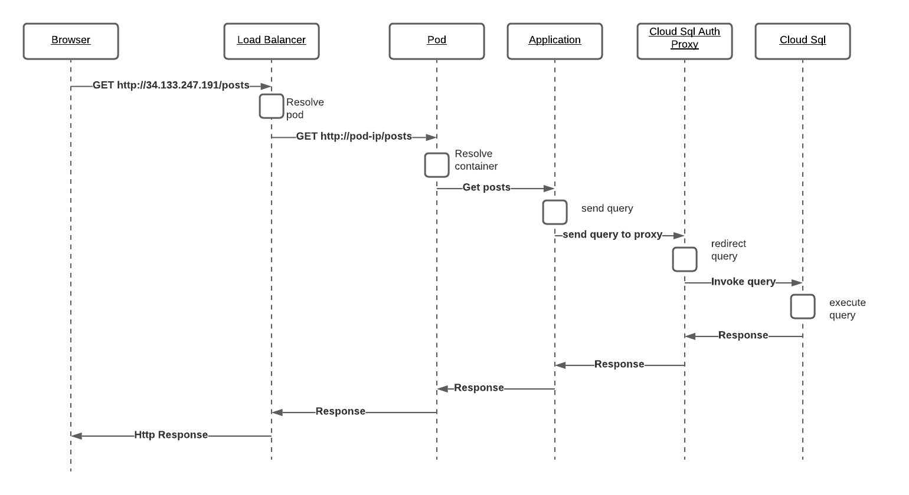
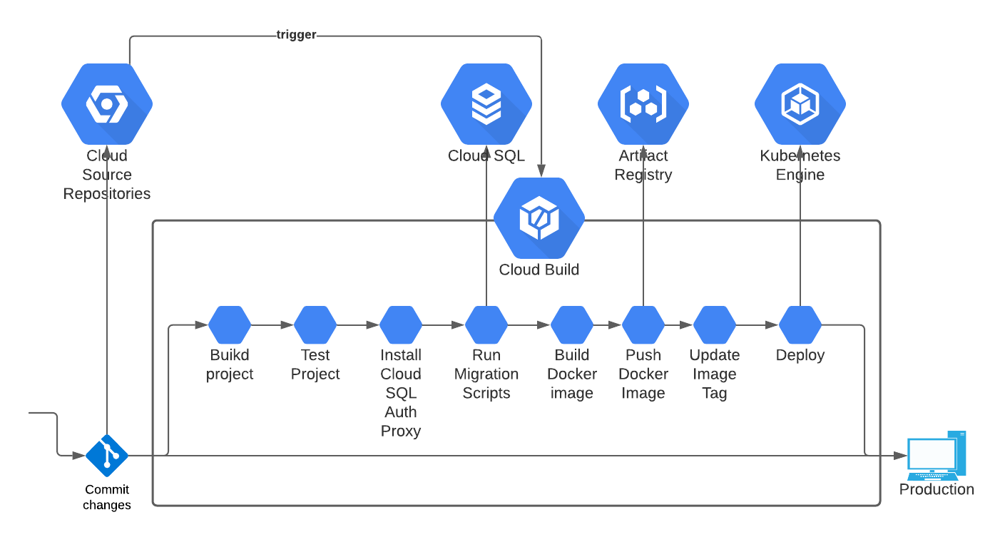

#Final challenge task

##Table of content

- [Diagrams](#diagrams)
    * [Request Flow](#request-flow)
    * [Ci/CD flow](#cicd-flow)
- [Tasks](#tasks)
    * [Tasks 1. Manual Docker Build Image](#task-1-manual-build-docker-image-10-points)
    * [Tasks 2. Automate Build Docker Image](#task-2-automate-build-docker-image-10-points)
    * [Tasks 3. Manual Docker Image Deployment](#task-3-manual-docker-image-deployment-10-points)
    * [Tasks 4. Automate Docker Image Deployment](#task-4-automate-docker-image-deployment-10-points)
    * [Tasks 5. Connect to Database using Cloud SQL Auth Proxy](#task-5-connect-to-database-using-cloud-sql-auth-proxy)
    * [Tasks 6. Manual SQL migration scripts](#task-6-manual-sql-migration-scripts-10-points)
    * [Tasks 7. Automate SQL migration scripts](#task-7-automate-sql-migration-scripts-10-points)
    * [Tasks 8. Expose your service over Cloud Load Balancer with external static IP address](#task-8-expose-your-service-over-cloud-load-balancer-with-external-static-ip-address-10-points)
- [Result](#results)
***

##Diagrams
Diagrams regarding gcp-project

###Request flow


###CI/CD flow

***

##Tasks

###Task 1. Manual Build Docker Image (10 points)
*	Create a Cloud Source Repository with your app (HTTP Server).
*	Add a Dockerfile file into your repository to build your app.
*	Test the created Docker image.
*	Push the Docker image into the Artifact Repository.
***

1. Create the repository
   ```
   gcloud source repos create gcp-project
   ```
2. Clone the repos
   ```
   gcloud source repos clone gcp-project
   ```
3. Create an image for project
   ```dockerfile
   docker build -t gcp-project:0.0.1 .
   ```
4. Run docker iamge
   ```dockerfile
   docker run -p 8080:8080 gcp-project:0.0.1 &
   ```
5. Test docker container
   ```
   curl localhost:8080/posts
   ```
6. Create Docker repository
   ```
   gcloud artifacts repositories create gcp-project-docker-repo --repository-format=docker \
   --location=us-central1 --description="Docker repository for gcp project"
   ```

   Verify that repository was created
   ```
   gcloud artifacts repositories list
   ```
7. Configure authentication to docker
   ```
   gcloud auth configure-docker us-central1-docker.pkg.dev
   ```
8. Tag the image
   Get the project name
   ```
   gcloud config get-value project
   ```
   ```dockerfile
   docker tag gcp-project:0.0.1 us-central1-docker.pkg.dev/gcp-project-322518/gcp-project-docker-repo/gcp-project:0.0.1
   ```
   Where

   * PROJECT is your Google Cloud project ID. If your project ID contains a colon (:), see Domain-scoped projects.
   * us-central1 is the repository location.
   * docker.pkg.dev is the hostname for Docker repositories.
   * quickstart-image is the image name you want to use in the repository. The image name can be different than the local image name.
   * tag1 is a tag you're adding to the Docker image. If you didn't specify a tag, Docker will apply the default tag latest.

9. Push the docker image to repo
   ```dockerfile
   docker push us-central1-docker.pkg.dev/gcp-project-322518/gcp-project-docker-repo/gcp-project:0.0.1
   ```
   or
   ```
   gcloud builds submit --tag us-central1-docker.pkg.dev/PROJECT/gcp-project-docker-repo/gcp-project:0.0.1
   ```
***

###Task 2. Automate Build Docker Image (10 points):
* Create a pipeline in Cloud Build to build a Docker image when the source code changes.
***

1. create a build pipeline cloudbuild.yaml
```yaml
   steps:
     - name: 'gcr.io/cloud-builders/docker'
       args: [ 'build', '-t', 'us-central1-docker.pkg.dev/gcp-project-322518/gcp-project-docker-repo/gcp-project:0.0.1', '.' ]
     - name: 'gcr.io/cloud-builders/docker'
       args: [ 'push', 'us-central1-docker.pkg.dev/gcp-project-322518/gcp-project-docker-repo/gcp-project:0.0.1' ]
   images: ['us-central1-docker.pkg.dev/gcp-project-322518/gcp-project-docker-repo/gcp-project:0.0.1']
  ```

2. Run the pipeline using command
```
gcloud builds submit --config cloudbuild.yaml
```

3. Create the trigger
```
gcloud beta builds triggers create cloud-source-repositories --repo=gcp-project --branch-pattern=master --build-config=cloudbuild.yaml
```
Where:

* REPO_NAME is the name of your repository.
* BRANCH_PATTERN is the branch name in your repository to invoke the build on.
* TAG_PATTERN is the tag name in your repository to invoke the build on.
* BUILD_CONFIG_FILE is the path to your build configuration file.
* SERVICE_ACCOUNT is the email associated with your service account. If you don't include this flag, the default Cloud Build service account is used.
***

###Task 3. Manual Docker Image Deployment (10 points):
* Use the image to create and expose a deployment in Kubernetes.
* Update the image and push a change to the deployment.
***

Work with cluster:
1. Create the cluster
   ```
   gcloud container clusters create nginx-1-cluster --zone=us-central1-a
   ```
   
2. Authenticate to the cluster
   ```
   gcloud container clusters get-credentials nginx-1-cluster --zone=us-central1-a
   ```
   
3. Create deployment.yaml
```yaml
apiVersion: apps/v1
kind: Deployment
metadata:
  annotations:
    deployment.kubernetes.io/revision: "1"
  generation: 1
  labels:
    app: gcp-project
  name: nginx-1
  namespace: default
spec:
  progressDeadlineSeconds: 600
  replicas: 2
  revisionHistoryLimit: 10
  selector:
    matchLabels:
      app: gcp-project
  strategy:
    rollingUpdate:
      maxSurge: 25%
      maxUnavailable: 25%
    type: RollingUpdate
  template:
    metadata:
      creationTimestamp: null
      labels:
        app: gcp-project
    spec:
      serviceAccountName: sql-service-account
      containers:
      - name: gcp-project-sha256-1
        image: INIT_IMAGE_NAME
        imagePullPolicy: Always
        env:
        - name: DB_USER
          valueFrom:
            secretKeyRef:
              name: postgres-db-secret
              key: database
        - name: DB_PASS
          valueFrom:
            secretKeyRef:
              name: postgres-db-secret
              key: password
        - name: DB_NAME
          valueFrom:
            secretKeyRef:
              name: postgres-db-secret
              key: database
        resources: {}
        terminationMessagePath: /dev/termination-log
        terminationMessagePolicy: File
```
   
4. Apply deployment using command
   ```
   kubectl apply -f deployment.yaml
   ```   

***

###Task 4. Automate Docker Image Deployment (10 points):
* Create a pipeline in Cloud Build to deploy a new version of your image when the source code changes.
***

1. Modify cloudbuild.yaml file. Needs to add steps, where new image version should be set in the deployment.yaml
```yaml
- id: Update Image Tag
  name: ubuntu
  args: [ 'bash','-c','sed -i "s|INIT_IMAGE_NAME|us-central1-docker.pkg.dev/gcp-project-322518/gcp-project-docker-repo/gcp-project:$SHORT_SHA|" k8s/deployment.yaml' ]
```

2. Modify cloudbuild.yaml file. Needs to apply updated deployment.yaml
```yaml
- id: Updating Deployment
  name: gcr.io/cloud-builders/kubectl
  args: ['apply','-f','k8s/deployment.yaml']
  env:
    - CLOUDSDK_COMPUTE_ZONE=us-central1-a
    - CLOUDSDK_CONTAINER_CLUSTER=nginx-1-cluster
```
***

###Task 5. Connect to Database using Cloud SQL Auth Proxy.

1. Create sql instance with private IP. (or both: private and public)

2. For getting access for application to Cloud Sql, needs to configure SQL Auth Proxy.
You can find detailed instruction here: https://cloud.google.com/sql/docs/mysql/connect-kubernetes-engine.
   
Create secrets
```
kubectl create secret generic postgres-db-secret> \
--from-literal=username=db_username \
--from-literal=password=db_pass \
--from-literal=database=db_database
```

Enable Workload Identity on your cluster
```
gcloud container clusters update nginx-1-cluster \
--workload-pool=gcp-project-322518.svc.id.goog
```

Create service-account.yaml
```yaml
apiVersion: v1
kind: ServiceAccount
metadata:
  name: <YOUR-KSA-NAME> # TODO(developer): replace these values
```

Apply file
```
kubectl apply -f service-account.yaml
```

Enable the IAM binding between your YOUR-GSA-NAME and YOUR-KSA-NAME
```
gcloud iam service-accounts add-iam-policy-binding \
--role="roles/iam.workloadIdentityUser" \
--member="serviceAccount:gcp-project-322518.svc.id.goog[default/sql-service-account]" \
postgres-service-account@gcp-project-322518.iam.gserviceaccount.com
```

Add an annotation to YOUR-KSA-NAME to complete the binding
```
kubectl annotate serviceaccount \
sql-service-account \
iam.gke.io/gcp-service-account=postgres-service-account@gcp-project-322518.iam.gserviceaccount.com
```

###Task 6. Manual SQL migration scripts (10 points)
1. Add liquibase library to pom.xml
```xml
 <dependency>
    <groupId>org.liquibase</groupId>
    <artifactId>liquibase-core</artifactId>
 </dependency>
```

2. Create migration scripts. File db.changelog-0.0.0.yaml
```yaml
databaseChangeLog:
  - changeSet:
      id: create-table-posts
      author: aleksei
      preConditions:
        - onFail: MARK_RAN
          not:
            tableExists:
              tableName: posts
      changes:
        - createTable:
            columns:
              - column:
                  autoIncrement: true
                  constraints:
                    nullable: false
                    primaryKey: true
                    primaryKeyName: posts_pkey
                  name: id
                  type: BIGINT
              - column:
                  constraints:
                    nullable: false
                  name: title
                  type: VARCHAR(250)
              - column:
                  name: description
                  type: VARCHAR(250)
              - column:
                  constraints:
                    nullable: false
                  name: full_text
                  type: VARCHAR(250)
              - column:
                  constraints:
                    nullable: false
                  name: author
                  type: VARCHAR(250)
            tableName: posts
```
and file db.changelog-master.yaml
```yaml
databaseChangeLog:
  - include:
      file: db/changelog/db.changelog-0.0.0.yaml
```
3. Run script using command:
```
mvn liquibase:update
```

***

###Task 7. Automate SQL migration scripts (10 points)
***

Modify cloudbuild.yaml file. add such fragments:
```yaml
#Step 3. Install Cloud SQL proxy
- id: Install Cloud Sql Auth Proxy
  name: maven:3-jdk-11
  entrypoint: sh
  args:
    - "-c"
    - "wget https://dl.google.com/cloudsql/cloud_sql_proxy.linux.amd64 -O cloud_sql_proxy && chmod +x cloud_sql_proxy"

#Step 4. Run migration scripts using liquibase
- id: Run migration scripts
  name: maven:3-jdk-11
  entrypoint: sh
  args:
    - "-c"
    - "(./cloud_sql_proxy -instances=gcp-project-322518:us-central1:postgre-instance=tcp:localhost:5432 & sleep 2) && mvn liquibase:update -Dliquibase.url=jdbc:postgresql://$$DB_HOST/$$DB_NAME -Dliquibase.username=$$DB_USER -Dliquibase.password=$$DB_PASS"
  timeout: "150s"
  secretEnv: ['DB_PASS', 'DB_USER', 'DB_HOST', 'DB_NAME']
  waitFor: ["Install Cloud Sql Auth Proxy"]
```
Step 3 required for installing Cloud SQL Auth proxy, otherwise, it will be impossible to connect to Postgres sql.
Step 4. will run Cloud SQL Auth proxy  then will run liquibase command for migration.
Here such secrets as DB_PASS', 'DB_USER', 'DB_HOST', 'DB_NAME' comes from Secret management.
Fod fetch secrets from secrets manager needs to modify cloudbuild.yaml
```yaml
availableSecrets:
  secretManager:
    - versionName: projects/325607545884/secrets/POSTGRES_PASSWORD/versions/2
      env: 'DB_PASS'
    - versionName: projects/325607545884/secrets/POSTGRES_USERNAME/versions/1
      env: 'DB_USER'
    - versionName: projects/325607545884/secrets/POSTGRES_HOST/versions/2
      env: 'DB_HOST'
    - versionName: projects/325607545884/secrets/POSTGRES_DATABASE/versions/1
      env: 'DB_NAME'
```

###Task 8. Expose your service over Cloud Load Balancer with external static IP address (10 points)
***

1. Create service.yaml
```yaml
apiVersion: v1
kind: Service
metadata:
  annotations:
    cloud.google.com/neg: '{"ingress":true}'
  finalizers:
  - service.kubernetes.io/load-balancer-cleanup
  labels:
    app: gcp-project
spec:
  clusterIP: 10.64.3.149
  clusterIPs:
  - 10.64.3.149
  externalTrafficPolicy: Cluster
  ports:
  - nodePort: 32412
    port: 80
    protocol: TCP
    targetPort: 8080
  selector:
    app: gcp-project
  sessionAffinity: None
  type: LoadBalancer
status:
  loadBalancer:
    ingress:
    - ip: 34.123.209.167

```

2. Execute command:

```
kubectl apply -f service.yaml
```

***

##Results

|Task | Status | Actual Points |
|-----|-----------------|---------------|
|Task 1|  :heavy_check_mark: |0|
|Task 2| 10|0|
|Task 3| 10|0|
|Task 4| 10|0|
|Task 5| 10|0|
|Task 6| 10|0|
|Task 7| 10|0|
|Task 8| 10|0|


